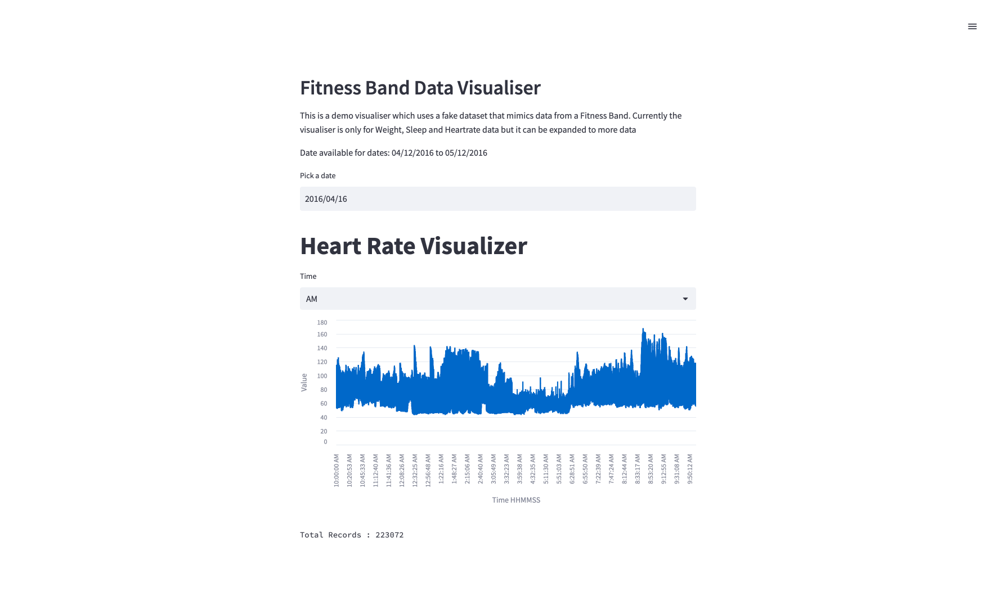
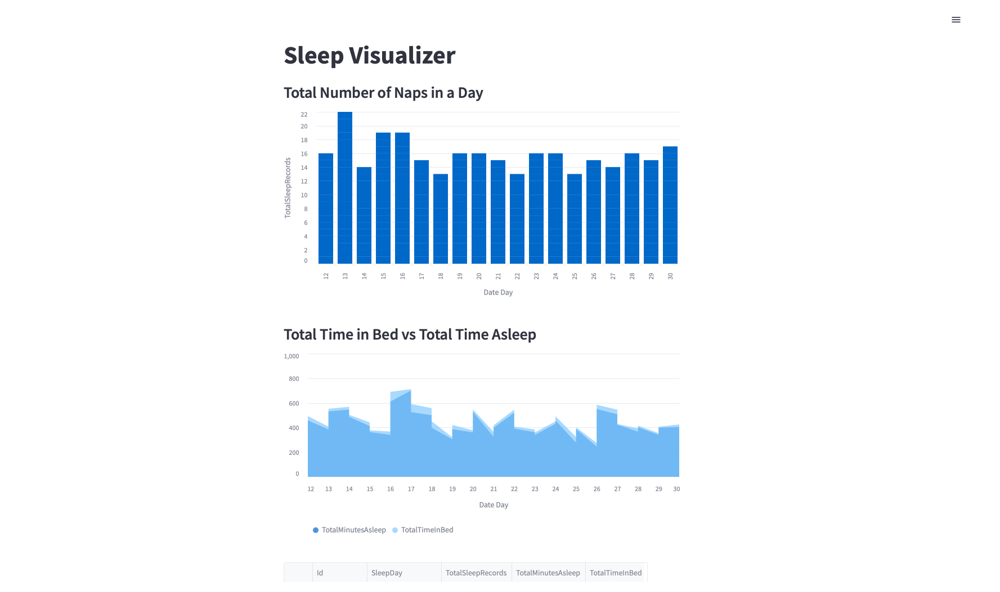
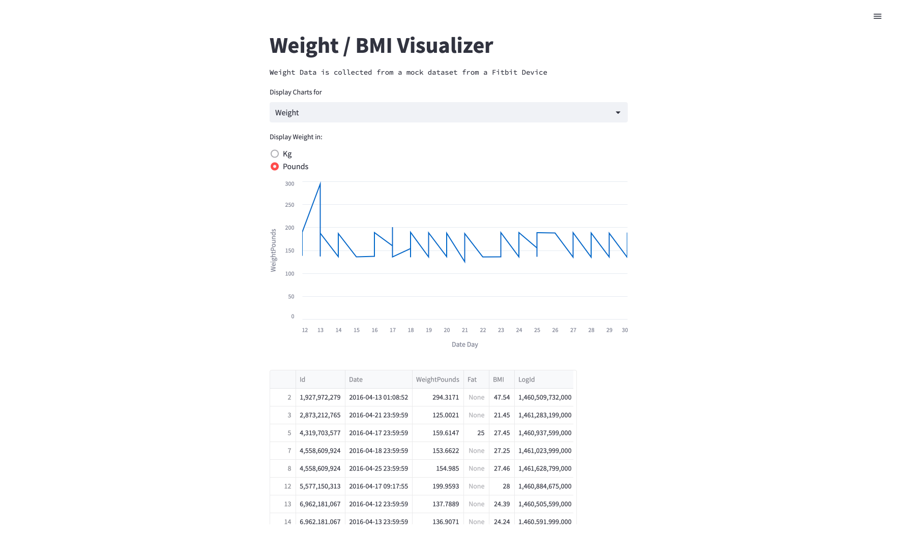

# Biosensor-Data-Visualizer
This project is to demonstrate a Biosentor Data Visualizer using Python and Streamlit. The dataset mimics data from a fitness band and contains data regarding Weight, Heartreate and Sleep of an individual users from over a month. I'm using Pandas to read, search and filter the dataset 

## Steps to Run
1. Install dependencies from requirements.txt
2. go to the project directory and run `streamlit run app.py`

